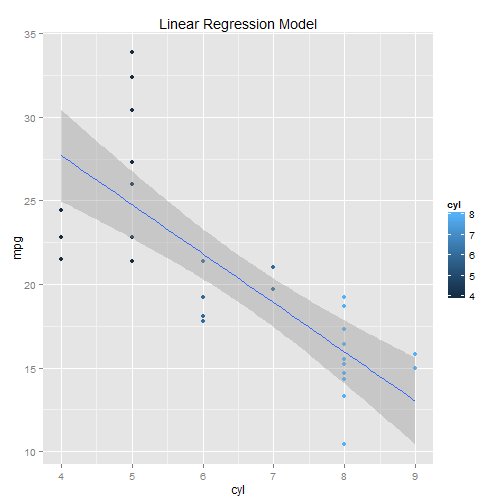

Effect of different variables on miles/galon and transmission
========================================================
author: Lakshmi Narayana
date: 22 March 2015

Objective
========================================================

The aim of this application is to show case the relation between miles per galon and transmission to the other variables of mtcars dataset***mtcars dataset***.

Link to the Application and Source
========================================================

- [Application URL](https://mylcat.shinyapps.io/mtcars_mpgvsaut/)
- [Source URL](https://github.com/Mylcat/mtcars_mpgvsaut)

Application Layout
========================================================

- The top panel on the left allows for selection of automatic/manual transmission
- The bottom panel on the left allows for selection of the variable to plot the model along with the automatic/manual transmission.
- The top panel on the right will display the selected variables in the left panel.
- The middle panel on the right will display the mean median values of the selected variable in the left panel from the mtcars dataset.
- The bottom two panels on the right will display the summary of the model and and plot of the model

!(shinyapps_image.jpg)

Summary of Mtcars
========================================================


```r
library(ggplot2)

summary(lm(mpg~am+cyl,data=mtcars))
```

```

Call:
lm(formula = mpg ~ am + cyl, data = mtcars)

Residuals:
    Min      1Q  Median      3Q     Max 
-5.6856 -1.7172 -0.2657  1.8838  6.8144 

Coefficients:
            Estimate Std. Error t value Pr(>|t|)    
(Intercept)  34.5224     2.6032  13.262 7.69e-14 ***
am            2.5670     1.2914   1.988   0.0564 .  
cyl          -2.5010     0.3608  -6.931 1.28e-07 ***
---
Signif. codes:  0 '***' 0.001 '**' 0.01 '*' 0.05 '.' 0.1 ' ' 1

Residual standard error: 3.059 on 29 degrees of freedom
Multiple R-squared:  0.759,	Adjusted R-squared:  0.7424 
F-statistic: 45.67 on 2 and 29 DF,  p-value: 1.094e-09
```

```r
qplot(am+cyl, mpg, data=mtcars, geom=c("point", "smooth"), 
                       method="lm", formula=y~x, color=cyl, 
                       main="Linear Regression Model", 
                       xlab="cyl", ylab="mpg")
```

 

Plot of the Model
========================================================

 
